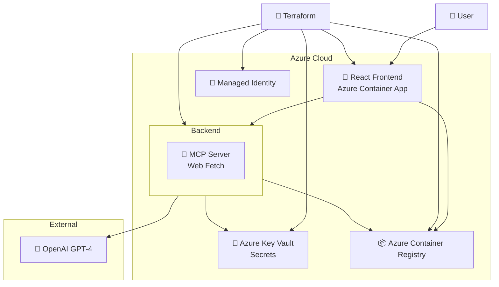

# 🚀 Vibe to Live: Production AI Agents

[](https://www.typescriptlang.org/)
[](https://reactjs.org/)
[](https://vitejs.dev/)
[](https://www.python.org/)
[](https://fastapi.tiangolo.com/)
[](https://openai.com/)
[](https://www.docker.com/)
[](https://www.terraform.io/)
[](https://azure.microsoft.com/)

> **A complete end-to-end example of building and deploying production-ready AI agents from prototype to cloud.**

This repository demonstrates how to transform a simple AI agent prototype into a fully-featured, production-ready application deployed on Azure. It showcases modern DevOps practices, containerization, and Infrastructure as Code (IaC) for AI applications.


## 🎯 What This Repo Is About

**Vibe to Live** represents the journey from rapid AI prototyping ("vibe") to production deployment ("live"). This repository serves as a comprehensive example of:

- **🤖 AI Agent Development**: Building intelligent agents using OpenAI GPT-4 with Model Context Protocol (MCP)
- **🏗️ Full-Stack Architecture**: React/TypeScript frontend + FastAPI/Python backend
- **🐳 Containerization**: Docker multi-stage builds optimized for production
- **☁️ Cloud Infrastructure**: Azure Container Apps with managed identities and security
- **🚀 Infrastructure as Code**: Terraform modules for reproducible deployments
- **🔒 Enterprise Security**: Azure Key Vault integration and secure authentication

## ✨ Features

### 🎨 Frontend
- **Modern React + TypeScript**: Built with Vite for lightning-fast development
- **Responsive Design**: TailwindCSS for beautiful, mobile-first UI
- **Real-time Interactions**: Seamless communication with AI agents
- **Production-Optimized**: Nginx-served static assets with proper caching

### ⚡ Backend
- **FastAPI Performance**: Async Python API with automatic OpenAPI documentation
- **AI Agent Integration**: OpenAI GPT-4 with custom tools and MCP servers
- **Weather Intelligence**: Real-time weather data with snowboarding recommendations
- **Security-First**: Managed identity authentication and secure API design

### 🏗️ Infrastructure
- **Azure Container Apps**: Serverless containers with auto-scaling
- **Container Registry**: Private Docker registry with managed identity access
- **Key Vault Integration**: Secure secret management without hardcoded credentials
- **Modular Terraform**: Reusable infrastructure components
- **Digest-based Deployments**: Automatic revision triggering for zero-downtime updates

## 🚀 Quick Start

### Prerequisites

- **Azure CLI** - [Install](https://docs.microsoft.com/en-us/cli/azure/install-azure-cli)
- **Terraform** >= 1.0 - [Install](https://www.terraform.io/downloads)
- **Docker** - [Install](https://docs.docker.com/get-docker/)
- **Node.js** 18+ - [Install](https://nodejs.org/)
- **Python** 3.11+ - [Install](https://www.python.org/)
- **OpenAI API Key** - [Get yours](https://platform.openai.com/api-keys)

### 🔧 Local Development

1. **Clone the repository**
   ```bash
   git clone https://github.com/rafaelpierre/vibe-to-live-agents-mcp.git
   cd vibe-to-live-agents-mcp
   ```

2. **Backend Setup**
   ```bash
   cd backend
   pip install uv
   uv sync
   export OPENAI_API_KEY="your-api-key-here"
   uv run uvicorn src.api:app --reload --host 0.0.0.0 --port 8000
   ```

3. **Frontend Setup**
   ```bash
   cd frontend
   npm install
   export VITE_API_URL="http://localhost:8000"
   npm run dev
   ```

4. **Visit**: http://localhost:5173

### ☁️ Production Deployment

1. **Azure Authentication**
   ```bash
   az login
   az account set --subscription "your-subscription-id"
   ```

2. **Configure Terraform**
   ```bash
   cd infra
   cp terraform.tfvars.example terraform.tfvars
   # Edit terraform.tfvars with your values
   ```

3. **Deploy Infrastructure**
   ```bash
   terraform init
   terraform plan
   terraform apply
   ```

4. **Access Your Application**
   ```bash
   # Get the URLs
   echo "Frontend: $(terraform output -raw frontend_app_url)"
   echo "Backend: $(terraform output -raw backend_app_url)"
   ```

## 🏗️ Architecture



## 📁 Project Structure

```
vibe-to-live-agents-mcp/
├── 🎨 frontend/                 # React + TypeScript + Vite
│   ├── src/                     # Source code
│   ├── public/                  # Static assets
│   ├── Dockerfile               # Multi-stage production build
│   └── nginx.conf               # Production web server config
│
├── ⚡ backend/                  # FastAPI + Python
│   ├── src/                     # Source code
│   │   ├── api.py              # FastAPI app and endpoints
│   │   └── pipeline.py         # OpenAI Agents SDK agent pipeline
│   ├── pyproject.toml          # Python dependencies (UV)
│   └── Dockerfile              # Production container
│
├── 🏗️ infra/                   # Terraform Infrastructure
│   ├── modules/                # Reusable Terraform modules
│   │   ├── container_registry/ # Azure Container Registry
│   │   ├── container_app/      # Azure Container Apps
│   │   ├── key_vault/          # Azure Key Vault
│   │   ├── managed_identity/   # Managed Identities
│   │   └── docker_build_push/  # Docker automation
│   ├── main.tf                 # Main infrastructure
│   ├── variables.tf            # Input variables
│   ├── outputs.tf              # Output values
│   └── terraform.tfvars        # Configuration (git-ignored)
│
└── 📚 README.md                # This file
```

## 🔒 Security Features

- **🔐 Zero Hardcoded Secrets**: All sensitive data in Azure Key Vault
- **🛡️ Managed Identities**: No stored credentials or connection strings
- **🔒 Private Registry**: Secure container image storage
- **📝 Access Policies**: Least-privilege access patterns
- **🚫 Git Security**: Sensitive files properly ignored

## 🚀 Deployment Features

- **📊 Digest-based Updates**: Automatic revision triggering on image changes
- **🔄 Zero Downtime**: Rolling deployments with health checks
- **📈 Auto-scaling**: Serverless scaling based on demand
- **🔍 Monitoring**: Built-in logging and observability
- **🏗️ Infrastructure as Code**: Reproducible deployments
- **🔧 Environment Separation**: Easy multi-environment setup

## 🛠️ Technology Stack

### Frontend
- **⚛️ React 18** - Modern component-based UI
- **📘 TypeScript** - Type-safe development
- **⚡ Vite** - Lightning-fast build tool
- **🎨 TailwindCSS** - Utility-first styling
- **🌐 Nginx** - Production web server

### Backend  
- **🚀 FastAPI** - High-performance async Python API
- **🤖 OpenAI GPT-4** - Advanced language model
- **📡 MCP (Model Context Protocol)** - Tool integration
- **🐍 Python 3.13** - Latest Python features
- **📦 UV** - Ultra-fast Python package manager

### Infrastructure
- **☁️ Azure Container Apps** - Serverless containers
- **🐳 Docker** - Containerization
- **🏗️ Terraform** - Infrastructure as Code
- **🔐 Azure Key Vault** - Secret management
- **👤 Managed Identities** - Secure authentication
- **📦 Azure Container Registry** - Private image storage

## 📚 Learn More

This repository is featured in the **Maven Course**:

### 🎓 [From Vibe to Live: Build and Deploy Production AI Agents](https://buildingaiagents.com)

Learn how to:
- 🏗️ Design production-ready AI agent architectures
- 🚀 Implement CI/CD pipelines for AI applications  
- ☁️ Deploy scalable AI systems on cloud platforms
- 🔒 Secure AI applications with enterprise-grade practices
- 📊 Monitor and optimize AI agent performance
- 🛠️ Build reusable infrastructure components

> **Transform your AI prototypes into production-ready applications that scale!**

## 🤝 Contributing

Contributions are welcome! Please feel free to:

1. 🍴 Fork the repository
2. 🌟 Create a feature branch
3. 💻 Make your changes
4. ✅ Add tests if applicable
5. 📤 Submit a pull request

## 📄 License

This project is licensed under the MIT License - see the [LICENSE](LICENSE) file for details.

---

<div align="center">
  <strong>Built with ❤️ for the AI community</strong>
  <br>
  <sub>From prototype to production in record time! 🚀</sub>
</div>
